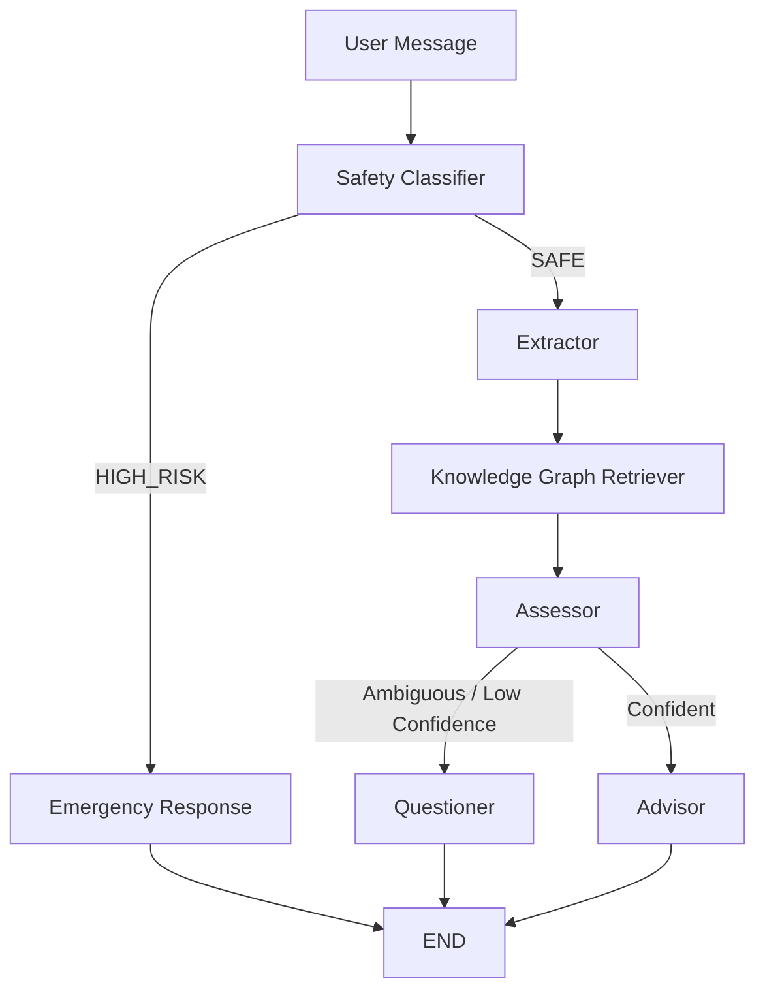

# 🌱 ResiliMind

### A Knowledge-Graph-Grounded, Stateful LLM Agent for Psychological Resilience Support

**ResiliMind** is a research-oriented, Persian-first conversational AI system designed to analyze user messages through a structured resilience framework, maintain longitudinal user context, and generate grounded, personalized responses.

The system combines:

* Large Language Models (LLMs)
* LangGraph-based stateful workflows
* Structured Pydantic outputs
* A curated NetworkX Knowledge Graph
* Evidence-aware resilience assessment
* Deterministic score and status computation
* Short-term conversational memory
* Long-term temporal resilience history
* Safety-first routing
* A modular Streamlit interface
* Local LLM inference through Ollama

Rather than treating an LLM as a standalone chatbot, ResiliMind uses the model as one component inside a controlled multi-stage decision pipeline.

> **Research Prototype Disclaimer**
>
> ResiliMind is an experimental AI-assisted resilience support system. It is **not** a medical device, diagnostic system, psychotherapy replacement, or clinically validated mental-health assessment tool. Its outputs should not be interpreted as professional psychological or medical advice.

---

## ✨ Why ResiliMind?

Most LLM-based conversational systems follow a relatively simple pattern:

```text
User Message
     ↓
LLM
     ↓
Response
```

This approach makes it difficult to control reasoning, preserve structured state, maintain longitudinal context, or ensure that generated responses are grounded in an explicit knowledge representation.

ResiliMind follows a different design philosophy:

```text
User Message
     ↓
Safety Gate
     ↓
Signal Extraction
     ↓
Knowledge Graph Retrieval
     ↓
Evidence-Based Assessment
     ↓
Confidence / Ambiguity Routing
     ├── Clarification
     └── Advice
     ↓
Persistent Memory
```

The core idea is to combine **LLM flexibility** with **structured state, explicit knowledge, deterministic logic, and persistent memory**.

---

# 🧠 Core Concepts

ResiliMind is built around five major concepts.

## 1. Structured Signal Extraction

The first language-model stage identifies which resilience-related concepts are expressed in the user's message.

Each extracted signal contains:

* `node_id`
* `detected_signal`
* `evidence`

For example:

```json
{
  "node_id": "IND_PER_01",
  "detected_signal": "negative",
  "evidence": "دیگه از پس این شرایط برنمیام"
}
```

The evidence is explicitly linked to an exact substring of the user's message rather than relying exclusively on an abstract LLM interpretation.

---

## 2. Knowledge Graph Grounding

Instead of asking the LLM to reason entirely from its parametric knowledge, ResiliMind provides a curated resilience Knowledge Graph.

The graph is implemented with `NetworkX` and contains structured information such as:

* resilience nodes
* domains
* Persian and English labels
* descriptions
* positive and negative cues
* status definitions
* intervention suggestions
* cross-domain relationships

The graph currently covers six major resilience domains:

| Domain                          | Description                                                                     |
| ------------------------------- | ------------------------------------------------------------------------------- |
| Personal Resilience             | Self-efficacy, hardiness, emotional regulation, goals and future orientation    |
| Political Resilience            | Cognitive immunity, political agency, resistance to polarization and alienation |
| Economic Resilience             | Financial adaptation, career resilience and economic stress                     |
| Physical Resilience             | Sleep, nutrition, somatic responses and physical coping                         |
| Social Resilience               | Family cohesion, peer support and interpersonal resilience                      |
| Spiritual / Cultural Resilience | Meaning-making, identity and cultural connectedness                             |

The graph acts as a structured knowledge layer between extraction and generation.

```text
User Message
     │
     ▼
Signal Extraction
     │
     ▼
Active Graph Nodes
     │
     ▼
NetworkX Retrieval
     │
     ├── Definitions
     ├── Status Levels
     ├── Interventions
     └── Cross-Domain Relationships
     │
     ▼
LLM Assessment / Advice
```

---

# 🛡️ Safety-First Architecture

Safety is treated as a dedicated stage rather than something delegated entirely to the final conversational model.

Every user message first passes through a **Safety Gate**.

```text
                    User Message
                         │
                         ▼
                  ┌──────────────┐
                  │  Safety Gate │
                  └──────┬───────┘
                         │
              ┌──────────┴──────────┐
              │                     │
          High Risk               Safe
              │                     │
              ▼                     ▼
     Emergency Response         Extractor
```

The safety layer combines:

1. Fast heuristic screening
2. LLM-based structured classification
3. Explicit high-risk routing

The safety model distinguishes between categories such as:

* `SAFE`
* `SELF_HARM`
* `VIOLENCE`
* `SEVERE_ABUSE`

The system is intentionally conservative around ambiguous high-risk expressions.

## Safety failure handling

Safety classification is treated as a gate before normal resilience analysis.

This prevents the regular Extractor → Retriever → Assessor → Advisor path from being used for messages that may require a dedicated safety response.

> ResiliMind's safety layer is an architectural safeguard, not a clinically validated crisis-detection system.

---

# 🧩 Multi-Agent Workflow

The core workflow is implemented with **LangGraph**.



## Agent responsibilities

### Safety Classifier

Determines whether the user message should enter the normal resilience pipeline or the emergency-response path.

### Extractor

Identifies active resilience nodes and produces structured evidence.

### Graph Retriever

Retrieves the relevant graph context for the extracted nodes.

### Assessor

Evaluates the activated resilience dimensions using:

* extracted evidence
* signal polarity
* current user message
* graph context

### Questioner

Handles ambiguity and insufficient confidence by asking a targeted clarification question instead of forcing an assessment.

### Advisor

Generates a personalized response using:

* current graph context
* current assessments
* historical resilience trajectory
* conversational context

---

# 📊 Evidence-Based Resilience Scoring

The Assessor does not directly generate a final `0–100` score or a `GREEN/YELLOW/RED` status.

Instead, the LLM evaluates four independent dimensions.

Each dimension is scored from `0` to `25`:

| Dimension     | 0                              | 25                       |
| ------------- | ------------------------------ | ------------------------ |
| Severity      | Severe / overwhelming distress | Mild or no distress      |
| Frequency     | Constant / chronic             | Rare / isolated          |
| Functionality | Severe impairment              | Fully functional         |
| Coping        | No coping / surrender          | Strong coping mechanisms |

The final score is calculated deterministically:

```text
Total Score =
    Severity
  + Frequency
  + Functionality
  + Coping
```

The resulting resilience status is then derived in Python:

```text
70–100  → GREEN
40–69   → YELLOW
0–39    → RED
```

This separation is deliberate:

```text
LLM
 ↓
Evidence Dimensions
 ↓
Python
 ↓
Total Score
 ↓
Status
```

This reduces the amount of business logic delegated to the LLM and makes score aggregation reproducible.

---

# 🎯 Confidence and Routing

The system does not rely exclusively on the confidence value reported by the LLM.

A composite confidence heuristic combines:

```text
30% → LLM self-reported confidence
30% → Evidence density
40% → Logical consistency
```

The resulting confidence is used for workflow routing.

```text
Assessment
    │
    ▼
Composite Confidence
    │
    ├── < 0.70 ──→ Questioner
    │
    └── ≥ 0.70 ──→ Advisor
```

The logical-consistency component considers the relationship between:

* extracted signal polarity
* assessed resilience status

The confidence value should be understood as a **heuristic routing signal**, not a statistically calibrated probability.

---

# 🧠 Memory Architecture

ResiliMind uses multiple forms of state and memory.

## 1. LangGraph Conversational Memory

LangGraph maintains the current conversational state and message history.

The state contains information such as:

```text
user_id
user_message
safety_status
safety_flag
active_nodes
active_signals
subgraph_context
assessments
requires_disambiguation
final_response
messages
```

This allows individual agents to operate on a shared state instead of maintaining isolated context.

---

## 2. Persistent Checkpoint Memory

The LangGraph execution state is persisted using SQLite checkpointing.

This allows the workflow to retain conversational state across interactions.

---

## 3. Long-Term Resilience History

In addition to conversation history, ResiliMind stores resilience assessments in a separate SQLite database.

Historical assessments can be represented as:

```text
Node: IND_PER_01

[2026-08-01] RED(25)
        ↓
[2026-08-04] YELLOW(52)
        ↓
[2026-08-09] YELLOW(63)
        ↓
[2026-08-13] GREEN(74)
```

The Advisor can use this historical trajectory when generating responses.

This enables longitudinal context beyond the current chat message.

### Current memory model

The project currently focuses on **temporal structured resilience history** rather than a fully consolidated semantic-memory engine.

A future direction is to derive higher-level memories such as:

* recurring problems
* persistent patterns
* improvement trends
* worsening trends
* repeated coping mechanisms
* intervention outcomes
* user preferences

---

# 🔗 Knowledge Graph Design

The resilience graph is stored as a structured JSON asset and loaded into a `NetworkX.DiGraph`.

Each node can contain:

```text
name_fa
name_en
domain
domain_fa
description
cues
status_levels
interventions
```

Cross-domain relationships are represented using directed graph edges.

Example conceptual structure:

```text
Economic Stress
       │
       ├───────────────┐
       ▼               ▼
Emotional Regulation   Self-Efficacy
       │
       ▼
Social Functioning
```

The Retriever converts the relevant graph information into structured textual context for the language model.

This provides a lightweight form of graph-grounded generation without requiring an external graph database.

---

# 🧱 Structured Output Architecture

ResiliMind uses Pydantic models to constrain model outputs.

Key schemas include:

```text
SafetyOutput
ActiveSignal
ExtractionOutput
EvidenceScores
NodeAssessment
AssessmentOutput
ProcessResult
```

For example, an extracted signal is constrained to:

```text
positive
negative
mixed
```

and each score dimension is constrained to:

```text
0 ≤ score ≤ 25
```

This is preferable to relying on free-form JSON parsing or unconstrained natural-language responses.

---

# 🤖 Local LLM Architecture

ResiliMind uses Ollama for local model inference.

The configured default model is:

```text
gemma4:e2b
```

The LLM layer is encapsulated inside `LLMEngine`.

The engine provides specialized model instances for:

```text
Safety
Extractor
Assessor
Conversation
```

Task-specific temperatures are used to separate deterministic extraction/classification behavior from more generative conversational behavior.

The LLM engine also caches model instances to avoid unnecessary repeated initialization.

---

# 🔧 Centralized Configuration

Configuration is managed through Pydantic Settings.

The following parameters can be configured via environment variables or `.env`:

```env
RESILIMIND_LLM_MODEL=gemma4:e2b
RESILIMIND_LLM_TEMPERATURE=0.6
OLLAMA_BASE_URL=http://localhost:11434
DATA_DIR=data
```

## Configuration

| Variable                     | Default                  | Description                               |
| ---------------------------- | ------------------------ | ----------------------------------------- |
| `RESILIMIND_LLM_MODEL`       | `gemma4:e2b`             | Ollama model used by ResiliMind           |
| `RESILIMIND_LLM_TEMPERATURE` | `0.6`                    | Temperature for conversational generation |
| `OLLAMA_BASE_URL`            | `http://localhost:11434` | Ollama API endpoint                       |
| `DATA_DIR`                   | `data`                   | Runtime directory for SQLite databases    |

The centralized configuration layer is also responsible for resolving:

```text
resilimind.db
checkpoints.db
```

---

# 🖥️ User Interface

The frontend is implemented with Streamlit.

The application is designed primarily for Persian-language interaction and includes:

* RTL interface
* Authentication
* Conversational chat
* Resilience dashboard
* Current resilience visualization
* Historical resilience information
* Evidence inspection
* Confidence display
* Interactive Plotly visualizations

The UI is separated into dedicated modules:

```text
ui/
├── auth.py
├── chat.py
├── dashboard.py
└── styles.py
```

The application entry point is intentionally lightweight and delegates functionality to these components.

---

# 🏗️ Project Structure

```text
ResiliMind/
│
├── pyproject.toml
├── uv.lock
├── .python-version
├── README.md
│
└── src/
    └── resilimind/
        │
        ├── app.py
        │
        ├── core/
        │   ├── agents.py
        │   ├── config.py
        │   ├── database.py
        │   ├── state.py
        │   └── workflow.py
        │
        ├── graph/
        │   ├── ingestion.py
        │   └── retriever.py
        │
        ├── llm/
        │   ├── engine.py
        │   └── prompts.py
        │
        ├── schemas/
        │   └── models.py
        │
        ├── services/
        │   ├── memory_service.py
        │   └── resilience_service.py
        │
        ├── ui/
        │   ├── auth.py
        │   ├── chat.py
        │   ├── dashboard.py
        │   └── styles.py
        │
        └── assets/
            ├── final_resilience_graph.json
            └── prompts/
                ├── extractor.txt
                ├── assessor.txt
                ├── advisor.txt
                ├── questioner.txt
                ├── safety_classifier.txt
                └── emergency_response.txt
```

---

# ⚙️ Technology Stack

| Technology        | Role                                    |
| ----------------- | --------------------------------------- |
| Python 3.13+      | Application runtime                     |
| LangGraph         | Stateful workflow orchestration         |
| LangChain         | LLM integration and runnable pipelines  |
| Ollama            | Local model serving                     |
| Gemma             | Default local LLM                       |
| NetworkX          | Knowledge Graph representation          |
| Pydantic          | Structured validation and typed outputs |
| Pydantic Settings | Environment-based configuration         |
| SQLite            | User data and persistent workflow state |
| Streamlit         | Web interface                           |
| Plotly            | Interactive visualization               |
| uv                | Dependency and environment management   |

---

# 🚀 Installation

## Prerequisites

Make sure the following are installed:

* Python `3.13+`
* Git
* `uv`
* Ollama

---

## 1. Clone the repository

```bash
git clone https://github.com/miladtavakolii/ResiliMind.git
cd ResiliMind
```

---

## 2. Install Python dependencies

```bash
uv sync
```

This creates and manages the project environment according to `pyproject.toml` and `uv.lock`.

---

## 3. Start Ollama

Make sure the Ollama service is running:

```bash
ollama serve
```

---

## 4. Pull the configured model

The default configuration expects:

```text
gemma4:e2b
```

Pull it through Ollama:

```bash
ollama pull gemma4:e2b
```

---

## 5. Optional: Configure environment variables

Create:

```text
.env
```

Example:

```env
RESILIMIND_LLM_MODEL=gemma4:e2b
RESILIMIND_LLM_TEMPERATURE=0.6
OLLAMA_BASE_URL=http://localhost:11434
DATA_DIR=data
```

---

## 6. Run ResiliMind

```bash
uv run streamlit run src/resilimind/app.py
```

Or:

```bash
streamlit run src/resilimind/app.py
```

The application will start locally through Streamlit.

---

# 🔄 End-to-End Execution

A typical message goes through the following process:

```text
┌─────────────────────┐
│    User Message     │
└──────────┬──────────┘
           │
           ▼
┌─────────────────────┐
│    Safety Gate      │
└──────────┬──────────┘
           │
      ┌────┴─────┐
      │          │
      ▼          ▼
   HIGH RISK    SAFE
      │          │
      ▼          ▼
 Emergency    Extractor
 Response        │
                 ▼
        Active Signals
                 │
                 ▼
        Knowledge Graph
                 │
                 ▼
             Assessor
                 │
          ┌──────┴──────┐
          │             │
       Ambiguous     Confident
          │             │
          ▼             ▼
      Questioner       Advisor
                        │
                        ▼
                 Final Response
                        │
                        ▼
                Persistent Memory
```

---

# 🧪 Assessment Pipeline

For each activated resilience node:

```text
1. Extract evidence
2. Identify signal polarity
3. Retrieve graph context
4. Evaluate four evidence dimensions
5. Calculate deterministic total score
6. Determine GREEN/YELLOW/RED status
7. Calculate composite confidence
8. Route to Questioner or Advisor
9. Persist the assessment
```

This creates a separation between:

```text
LLM Interpretation
```

and

```text
Deterministic Application Logic
```

which is one of the central design principles of the project.

---

# 📈 Dashboard

The dashboard is designed to provide a longitudinal overview of the user's resilience profile.

It can expose information such as:

* latest resilience status per node
* aggregate domain scores
* score trajectories
* extracted evidence
* polarity
* historical assessments
* confidence
* reasoning

Plotly is used for interactive visualization.

The dashboard is intended primarily as an exploratory research interface rather than a validated psychological measurement instrument.

---

# 🔐 Data and Privacy

ResiliMind is designed around local-first inference.

By default:

```text
User
 ↓
Streamlit
 ↓
Local Python Application
 ↓
Local Ollama
 ↓
Local SQLite
```

No external LLM API is required by the default architecture.

Persistent application data is stored locally through SQLite.

The main runtime databases are:

```text
data/resilimind.db
data/checkpoints.db
```

This architecture is particularly useful for experimentation involving sensitive conversational data because model inference can remain local.

> Local inference does not automatically make an application secure. Authentication, password storage, access control, database permissions, transport security, and deployment configuration must still be handled appropriately for real-world use.

---

# 🧩 Design Principles

ResiliMind follows several architectural principles.

## Structured over free-form

LLMs are used to produce typed structures wherever possible.

```text
Natural Language
      ↓
Pydantic Schema
      ↓
Validated State
```

---

## Grounded over purely generative

The Advisor does not operate exclusively on the current message.

It receives:

```text
Current User Message
+
Graph Knowledge
+
Current Assessment
+
Historical Resilience Profile
+
Conversation Context
```

---

## Deterministic over unnecessary LLM decisions

Where a result can be computed reliably in code, the application does it in code.

For example:

```text
Dimension Scores
      ↓
Python
      ↓
Total Score
      ↓
Status
```

rather than asking the LLM to independently generate the final status.

---

## Safety before personalization

High-risk messages are routed through a dedicated safety stage before normal resilience analysis.

---

## Stateful rather than stateless

The system maintains both:

* conversational state
* longitudinal resilience history

This allows future responses to incorporate changes over time rather than treating each message as an isolated interaction.

---

# 🔬 Research Motivation

ResiliMind is also intended as an experimental platform for studying the intersection of:

* Large Language Models
* Agentic workflows
* Knowledge Graphs
* Semantic memory
* Longitudinal user modeling
* Structured reasoning
* Human-AI interaction
* Safety-aware conversational AI

The project provides a practical foundation for investigating how external structured knowledge and persistent memory can constrain and improve LLM-based decision pipelines.

A central research direction is the transition from:

```text
Raw Conversation History
```

towards:

```text
Structured + Temporal + Semantic Memory
```

where the system can represent not only what the user said, but also persistent patterns derived from repeated interactions.

---


# 📚 Methodological Perspective

ResiliMind can be viewed as a layered intelligent system:

```text
Layer 1 — Interaction
Streamlit / Persian Conversational UI

Layer 2 — Safety
Risk detection and emergency routing

Layer 3 — Semantic Extraction
LLM-based signal detection

Layer 4 — Knowledge
Curated resilience Knowledge Graph

Layer 5 — Assessment
Evidence-based multidimensional scoring

Layer 6 — Decision
Confidence-aware conditional routing

Layer 7 — Memory
Conversation + longitudinal resilience history

Layer 8 — Generation
Grounded personalized response
```

This separation makes it possible to replace or improve individual components without redesigning the entire application.

---


# 👨‍💻 Author

**Milad Tavakoli**

GitHub:
https://github.com/miladtavakolii

Repository:
https://github.com/miladtavakolii/ResiliMind

---

# ⭐ Acknowledgement

ResiliMind is built using the open-source ecosystem around:

* LangGraph
* LangChain
* Ollama
* NetworkX
* Pydantic
* Streamlit
* Plotly

The project is intended as an experimental platform for studying structured, stateful, memory-aware LLM agents.

---

# ⚖️ Disclaimer

ResiliMind is an experimental research project.

It does **not** diagnose mental-health conditions, provide professional psychotherapy, or replace licensed psychological or medical care.

Any resilience score, status, recommendation, or generated response should be treated as an experimental AI output rather than a clinical assessment.

In situations involving immediate danger, self-harm, violence, or other emergencies, users should seek appropriate emergency or professional assistance rather than relying on an AI system.
